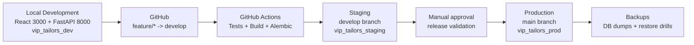

# VIP Tailors Environment Architecture

VIP Tailors uses three isolated environments. Each environment has its own application configuration, database, secrets, and release path.



## Environment Matrix

| Environment | Branch | URL | Database | Purpose |
| --- | --- | --- | --- | --- |
| Local | feature/*, fix/*, hotfix/* | http://localhost:3000 or http://localhost:8080 | vip_tailors_dev | Development and local testing |
| Staging | develop | https://staging.your-domain.com | vip_tailors_staging | Production-like QA |
| Production | main | live customer domain | vip_tailors_prod | Real business usage |

## Isolation Rules

- Local development must never use production credentials.
- Staging must have its own database and secrets.
- Production secrets must live only in Coolify or GitHub production environment secrets.
- Sanitized snapshots may be restored to staging/local, but raw production data should stay restricted.
- `VIP_CREATE_TABLES_ON_STARTUP=false` should be used in staging and production once Alembic is active.

## Runtime Shape

```text
Browser
  -> Vite dev server locally, or Nginx container in staging/production
  -> /api/* proxied to FastAPI
  -> FastAPI uses PostgreSQL through VIP_DATABASE_URL
```

The frontend already uses same-origin API paths (`/api/v1`), so no frontend code change is required for environment switching.
